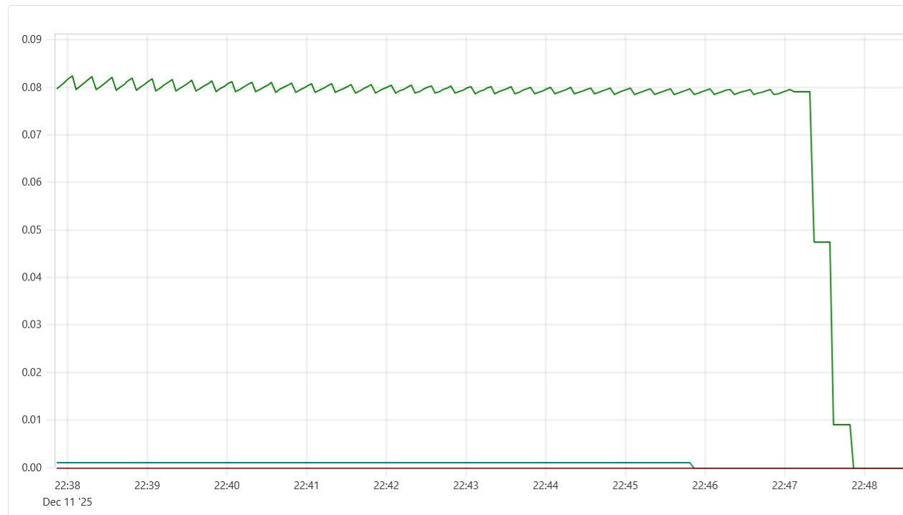
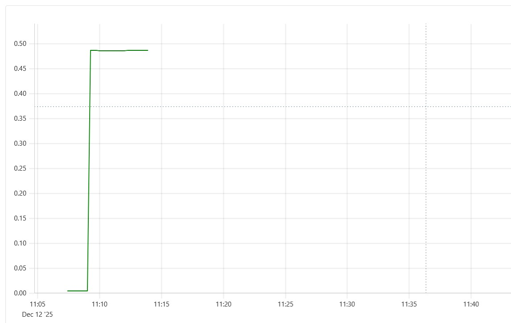
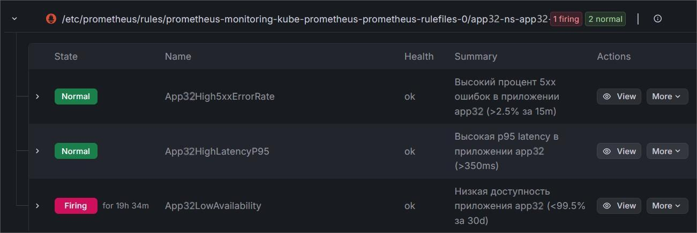

# ЛР04 — Наблюдаемость, Helm и GitOps (Вариант 32)

## Общая информация

Вариант 32:

* Префикс метрик: app32__ (из-за особенностей prometheus-flask-exporter с параметром defaults_prefix)
**SLO:**
* Доступность ≥ 99.5% (за 30d)
* p95 latency ≤ 350 ms
* Ошибки 5xx ≤ 2.5% за 15m

## Метаданные студента

- **ФИО:** Иванюк Иван Александрович
- **Группа:** АС-64
- **№ студенческого (StudentID):** 220041
- **Email (учебный):** [AS006412@g.bstu.by](AS006412@g.bstu.by)
- **GitHub username:** JonF1re
- **Вариант №:** 32
- **Дата выполнения:** 24.12.2025
- **ОС (версия):** Windows 11 Home 24H2
- **Версия Docker Desktop:** 4.49.0
- **Версия kubectl:** 1.35.0
- **Версия Helm:** 1.37.0

## Схема мониторинга

```text
Приложение (Flask)
└── экспонирует /metrics с префиксом app32__ (prometheus-flask-exporter)
└── Service (ClusterIP:5000)
└── ServiceMonitor (namespace app32-ns)
└── Prometheus (kube-prometheus-stack в namespace monitoring)
├── собирает метрики каждые 15s
├── хранит и предоставляет PromQL-запросы
└── оценивает PrometheusRule (алерты по SLO)
└── Alertmanager → (в ЛР только правила, без уведомлений)
└── Grafana → дашборды и просмотр алертов
```

Мониторинг установлен через kube-prometheus-stack (Prometheus Operator + Grafana + Alertmanager)
Приложение деплоится Helm-чартом с включёнными ServiceMonitor и PrometheusRule
Сбор метрик из другого namespace (app32-ns) разрешён через serviceMonitorNamespaceSelector: {}

## Структура репозитория

```text
.
├── src/app/
│   ├── app.py             
│   ├── Dockerfile
│   └── requirements.txt
├── helm/monitoring-app/
│   ├── Chart.yaml
│   ├── values.yaml
│   └── templates/
│       ├── deployment.yaml
│       ├── service.yaml
│       ├── ingress.yaml
│       ├── servicemonitor.yaml
│       ├── prometheusrule.yaml
│       └── _helpers.tpl
├── k8s/
│   └── install.sh          
└── README.md
└──monitoring-values.yaml
```

## Параметры Helm-чарта (values.yaml)

* replicaCount: 2
* namespace: app32-ns
**image:**
* repository: app32
* tag: latest
* pullPolicy: IfNotPresent
**service:**
* type: ClusterIP
* port: 5000
**ingress:**
* enabled: true
* className: nginx
**hosts:**
* host: app32.example.local
**paths:**
* path: /
* pathType: Prefix
**limits:**
* cpu: "500m"
* memory: "512Mi"
**requests:**
* cpu: "200m"
* memory: "256Mi"
**metrics:**
* prefix: app32_
serviceMonitor:
* enabled: true
* interval: 15s

## Установка

**Запуск Minikube**
minikube start --cpus=4 --memory=3072 --driver=docker
Установка kube-prometheus-stack
helm repo add prometheus-community <https://prometheus-community.github.io/helm-charts>
helm repo update

helm upgrade --install monitoring prometheus-community/kube-prometheus-stack   --namespace monitoring --create-namespace
-f monitoring-values.yaml
(файл monitoring-values.yaml разрешает сбор ServiceMonitor из всех namespace)

**Сборка образа приложения**
cd src/app
minikube docker-env --shell powershell | Invoke-Expression
docker build -t app32:latest .
cd ../../
**Деплой приложения**
helm upgrade --install app32 ./helm/monitoring-app --namespace app32-ns --create-namespace --wait

## Доступ

**риложение:** kubectl port-forward svc/app32-monitoring-app 5000:5000 -n app32-ns → <http://localhost:5000>
**Prometheus:** kubectl port-forward svc/monitoring-kube-prometheus-prometheus 9090:9090 -n monitoring → <http://localhost:9090>
**Grafana:** kubectl port-forward svc/monitoring-grafana 3000:80 -n monitoring → <http://localhost:3000> (admin/admin)

## Проверка работы

### Нагрузка

1..100 | ForEach-Object { Invoke-WebRequest <http://localhost:5000/> | Out-Null }
1..70 | ForEach-Object { Invoke-WebRequest <http://localhost:5000/slow> | Out-Null }
1..50 | ForEach-Object { Invoke-WebRequest <http://localhost:5000/error> | Out-Null }

**Метрики в Prometheus (префикс app32__):**

* app32__http_request_total
* rate(app32__http_request_total[5m])
* histogram_quantile(0.95, sum(rate(app32__http_request_duration_seconds_bucket[5m])) by (le))
* Процент 5xx: sum(rate(app32__http_request_total{status=~"5.."}[5m])) / sum(rate(app32__http_request_total[5m]))

**Алерты в Grafana → Alerting → Alert rules:**

* App32High5xxErrorRate (firing при >2.5%)
* App32HighLatencyP95 (firing при p95 >350ms)
* App32LowAvailability (оценка за 30d)

## Скриншоты





