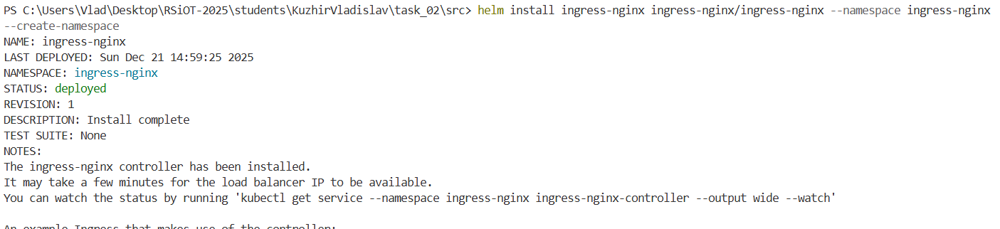
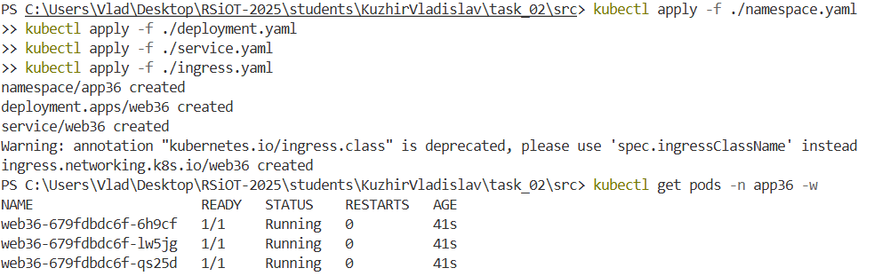
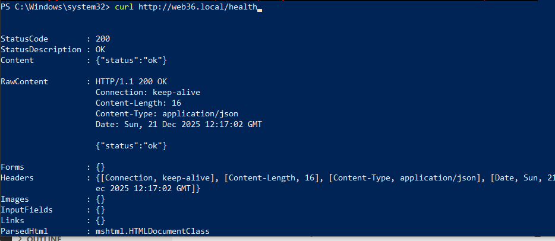

# Министерство образования Республики Беларусь

<p align="center">Учреждение образования</p>
<p align="center">“Брестский Государственный технический университет”</p>
<p align="center">Кафедра ИИТ</p>
<br><br><br><br><br><br>
<p align="center"><strong>Лабораторная работа №2</strong></p>
<p align="center"><strong>По дисциплине:</strong> “Распределенные системы и облачные технологии”</p>
<p align="center"><strong>Тема:</strong>Kubernetes: базовый деплой</p>
<br><br><br><br><br><br>
<p align="right"><strong>Выполнил:</strong></p>
<p align="right">Студент 4 курса</p>
<p align="right">Группы AC-64</p>
<p align="right">Кужир В.В.</p>
<p align="right"><strong>Проверил:</strong></p>
<p align="right">Несюк А.Н.</p>
<br><br><br><br><br>
<p align="center"><strong>Брест 2025</strong></p>

## «Метаданные студента»

- **ФИО:** Кужир Владислав Витальевич
- **Группа:** AS-64
- **№ студенческого:** 220047
- **Email:** vkuzir7@gmail.com
- **GitHub username:** XD-cods
- **Вариант №:** 36(для 1 делал 26)
- **Дата выполнения:** 21.12.2025
- **ОС:** Windows 10, Docker Desktop 4.46.0

## RSOT Проект

Это пример минимального HTTP-сервиса и набор Kubernetes-манифестов для лабораторной работы. Включает:

- Dockerfile (multi-stage, финальный образ ≤150 MB, не root)
- Приложение: минимальный HTTP-сервер с эндпоинтами `/`, `/health`, `/ready`.
- Логи запуска, остановки и корректного завершения
- Манифесты Kubernetes: Deployment (RollingUpdate + ресурсы), Service, ConfigMap, Secret, (опционально) PVC
- Настройки liveness/readiness probes
- Инструкции локального тестирования (kubectl)
-

### 1. Образы

Образы находяться на docker hub

### 2. Развертывание HTTP-сервиса в Kubernetes

#### 2.1 Запуск кластера

```bash
k3d cluster create rsiot-lab \
   --k3s-arg "--disable=traefik@server:0" \
   --port "80:80@loadbalancer" \
   --port "443:443@loadbalancer"
```


#### 2.2 Установка Ingress NGINX

```bash
helm install ingress-nginx ingress-nginx/ingress-nginx --namespace ingress-nginx --create-namespace
```

Установка NGINX.


#### 2.3 Создание Namespace

```bash
kubectl apply -f k8s/namespace.yaml
```

Создание отдельного пространства имён.


#### 2.4 Применение манифестов приложения

```bash
kubectl apply -f ./namespace.yaml
kubectl apply -f ./deployment.yaml
kubectl apply -f ./service.yaml
```

Создайте все необходимые ресурсы Kubernetes в нашем namespace.


#### 2.6 Применение Ingress

```bash
kubectl apply -f k8s/ingress.yaml
```

Настройка доступа к приложению через Ingress.


#### 2.7 Добавление записи в /etc/hosts

```bash
sudo sh -c "echo '127.0.0.1 web36.local' >> /etc/hosts"
```

Добавляет локальную запись для доступа к нашему приложению.

#### 2.8 Просмотр работоспособности подов

```bash
kubectl get pods -n app36
```


### 3. Подтвердить приложение

#### 3.1 Liveness

```bash
curl http://web36.local/health
```

Content : OK



### 4. Просмотр логов

#### 4.1 Просмотр логов аpp

```bash
kubectl logs <app-name> -n app36
```

### 5. Очистка ресурсов

```bash
kubectl delete -f ./ingress.yaml
kubectl delete -f ./service.yaml
kubectl delete -f ./deployment.yaml
kubectl delete -f ./namespace.yaml
```

### 6. Краткое описание проделанных действий

- Deployment — создан с типом стратегии RollingUpdate, добавлены ресурсные лимиты и запросы (resources.limits/requests) для контейнера.
- Service — настроен для доступа к приложению.
- ConfigMap и Secret — используются для передачи конфигурации и чувствительных данных в контейнер.
- Добавлен PersistentVolumeClaim и подключён volume для хранения данных приложения.
- Настроены livenessProbe и readinessProbe (HTTP), проверена их корректная работа.
- Подготовлены инструкции для локального тестирования:

1. Создание локального кластера;
2. Применение всех манифестов;
3. Проверка статуса Pod;
4. Выполнение smoke-теста через HTTP-запрос к эндпоинту приложения.
