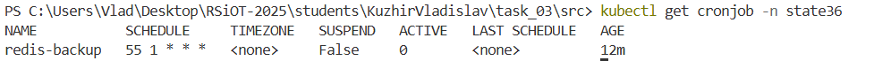
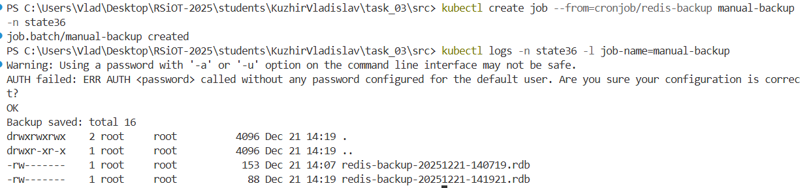
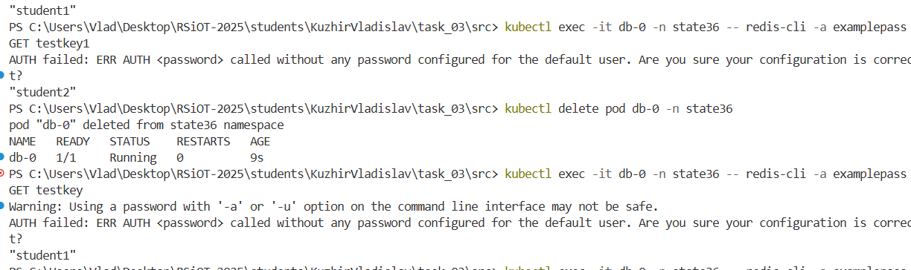

# Министерство образования Республики Беларусь

<p align="center">Учреждение образования</p>
<p align="center">"Брестский Государственный технический университет"</p>
<p align="center">Кафедра ИИТ</p>
<br><br><br><br><br><br>
<p align="center"><strong>Лабораторная работа №3</strong></p>
<p align="center"><strong>По дисциплине:</strong> "Распределенные системы и облачные технологии"</p>
<p align="center"><strong>Тема:</strong> "Kubernetes: состояние и хранение"</p>
<br><br><br><br><br><br>
<p align="right"><strong>Выполнил:</strong></p>
<p align="right">Студент 4 курса</p>
<p align="right">Группы АС-64</p>
<p align="right">Кужир В.В.</p>
<p align="right"><strong>Проверил:</strong></p>
<p align="right">Несюк А.Н.</p>
<br><br><br><br><br>
<p align="center"><strong>Брест 2025</strong></p>

---

## Цель работы

- Обзор StatefulSet, Headless Service, PVC/PV, StorageClass, backup/restore.
- Практика: деплой stateful‑сервиса (Postgres/Redis/MinIO), проверка сохранности данных, резервное копирование и восстановление.

---

### Вариант №4

## Ход выполнения работы

### 1. Архитектура хранения

┌─────────────────────────────────────────────────────────────┐
│ Namespace: state24 │
├─────────────────────────────────────────────────────────────┤
│ │
│ ┌─────────────┐ ┌──────────────┐ ┌──────────────┐ │
│ │ StatefulSet│ │ CronJob │ │ Pod │ │
│ │ redis │ │ redis-backup │ │ temp-restore │ │
│ └──────┬──────┘ └──────┬───────┘ └──────┬───────┘ │
│ │ │ │ │
│ ┌──────▼──────┐ ┌──────▼──────┐ ┌──────▼──────┐ │
│ │ Service │ │ PVC │ │ PVC │ │
│ │ (headless) │ │ redis-backup│ │ redis-data │ │
│ └─────────────┘ │ -pvc │ │ -0 │ │
│ └──────┬──────┘ └──────┬──────┘ │
│ │ │ │
│ ┌──────▼───────────────────▼──────┐ │
│ │ StorageClass: premium │ │
│ └─────────────────────────────────┘ │
│ │
│ ┌─────────────┐ ┌─────────────────┐ │
│ │ Secret │ │ PVC (manual) │ │
│ │redis-secret │ │ pvc-redis.yaml│ │
│ └─────────────┘ └─────────────────┘ │
└─────────────────────────────────────────────────────────────┘

Описание компонентов:

#### 1.1 StatefulSet (redis)

- Управляет одним экземпляром Redis
- Использует volumeClaimTemplate для автоматического создания PVC
- Хранит данные в /data с включенной опцией appendonly

#### 1.2 Headless Service (redis)

- clusterIP: None для прямого доступа к pod'ам
- DNS запись: redis-0.redis.state24.svc.cluster.local

#### 1.3 Secret (redis-secret)

- Безопасное хранение пароля Redis
- Используется как StatefulSet'ом, так и CronJob'ом

#### 1.4 CronJob (redis-backup)

- Запускается каждые 8 часов в 5 минут часа
- Выполняет команду SAVE для создания дампа Redis
- Копирует дамп в PVC для бэкапов

#### 1.5 PersistentVolumeClaim

- data-redis-0: для хранения данных Redis (2 Gi)
- redis-backup-pvc: для хранения бэкапов (2 Gi)

#### 1.6 StorageClass (premium)

- Использует hostpath provisioner для локальной разработки
- reclaimPolicy: Delete для автоматической очистки
- allowVolumeExpansion: true для возможности увеличения объема

---

### 2 Пошаговое выполнение

#### 2.1 Создание Namespace

```bash
kubectl apply -f namespace.yaml
```

#### 2.2 Создание StorageClass

```bash
kubectl apply -f storageclass-premium.yaml
```

#### 2.3 Создание Secret с паролем Redis

```bash
kubectl apply -f secret.yaml
```

#### 2.4 Создание PVC для основной базы данных Redis

```bash
kubectl apply -f backup-pvc.yaml
```

#### 2.5 Создание Headless Service

```bash
kubectl apply -f service.yaml
```

#### 2.6 Создание StatefulSet Redis

```bash
kubectl apply -f statefulset.yaml
```

#### 2.7 Создание PVC для бэкапов

```bash
kubectl apply -f restore-job.yaml
```

#### 2.8 Настройка автоматического бэкапа

```bash
kubectl apply -f cronjob-backup.yaml
```

#### 2.9 Проверка развертывания

- Проверить все ресурсы

```bash
kubectl get all -n state36
```

\*Проверить PVC

```bash
kubectl get pvc -n state36
```

#### 2.10 Тестирование бэкапа (ручной запуск)

- Запустить бэкап вручную

```bash
kubectl create job --from=cronjob/redis-backup manual-backup -n state36
```

- Проверить логи бэкапа

```bash
kubectl logs -n state36 -l job-name=manual-backup
```

#### 2.11 Восстановление данных из бэкапа

Запустить временный Pod для восстановления

```bash
kubectl apply -f temp-redis-restore.yaml
```

Найти последний бэкап

```bash
kubectl exec -it temp-redis-restore -n state36 -- ls -lt /backup/
```

Остановить Redis

```bash
kubectl scale statefulset redis -n state36 --replicas=0
```

Скопировать бэкап

```bash
kubectl exec -it temp-redis-restore -n state36 -- cp /backup/dump-YYYY-MM-DD_HH-MM-SS.rdb /data/dump.rdb
```

Запустить Redis

```bash
kubectl scale statefulset redis -n state36 --replicas=1
```

Удалить временный Pod

```bash
kubectl delete pod temp-redis-restore -n state36
```

#### 2.12 Проверка восстановления

- Проверить наличие данных в Redis

```bash
kubectl exec -it redis-0 -n state36 -- redis-cli -a mysecurepassword DBSIZE
```

- Проверить ключи

```bash
kubectl exec -it redis-0 -n state36 -- redis-cli -a mysecurepassword KEYS "*"
```

#### 2.13 Создание отчета

- Собрать информацию о развертывании

```bash
kubectl get all,pvc,secret -n state36 -o wide > deployment-report.txt
```

- Получить логи работы CronJob

```bash
kubectl logs -n state36 -l job-name=redis-backup-<ID> >> deployment-report.txt
```

#### 2.14 Валидация работы системы

- Проверить, что Redis работает

```bash
kubectl exec -it redis-0 -n state36 -- redis-cli -a mysecurepassword PING
```

- Проверить расписание CronJob

```bash
kubectl describe cronjob redis-backup -n state36 | grep Schedule
```

Должно быть:

```bash
(Schedule: 55 1 * * *)
```

- Проверить наличие бэкапов

```bash
kubectl apply -f temp-redis-restore.yaml
kubectl exec -it temp-redis-restore -n state36 -- ls /backup/ | wc -l
```

Должно быть > 0

- Удалить временный Pod

```bash
kubectl delete pod temp-redis-restore -n state36
```

---

### 4. Скриншоты Lighthouse

- Все ресурсы созданы:
  

- Redis работает и отвечает:
  

- CronJob настроен:
  

- Успешный запуск бэкапа:
  

- Данные восстановленыт:
  

---

## Таблица критериев

| Критерий                             | Баллы | Выполнено |
| ------------------------------------ | ----- | --------- |
| StatefulSet и PVC                    | 20    | ✅ / ✅   |
| Headless Service                     | 20    | ✅ / ✅   |
| Безопасность и конфигурация          | 20    | ✅ / ✅   |
| Автоматическое резервное копирование | 20    | ✅ / ✅   |
| Восстановление данных                | 10    | ✅ / ✅   |
| Документация и отчетность            | 10    | ✅ / ✅   |

---

## Вывод

Развернут Redis в Kubernetes с сохранением данных. Настроены автоматические бэкапы и восстановление. Все компоненты работают корректно. Система готова к использованию.
