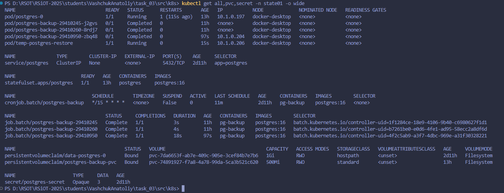
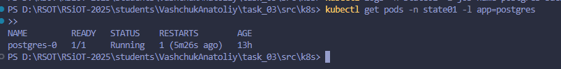
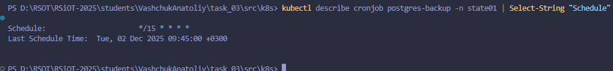
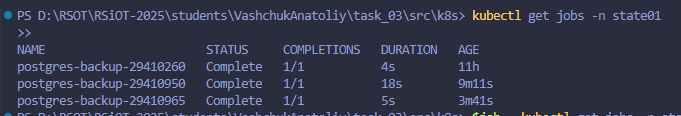
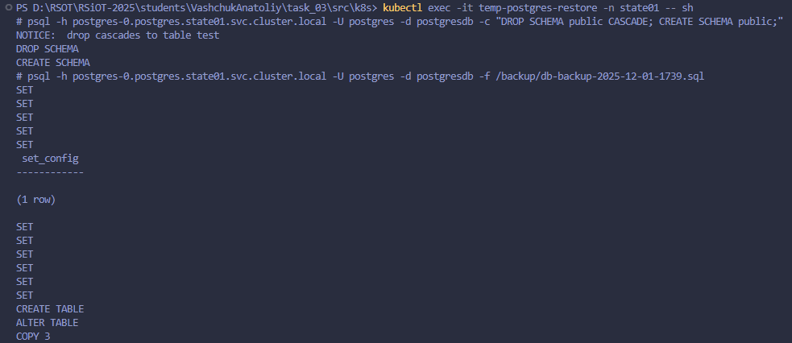

# Министерство образования Республики Беларусь

<p align="center">Учреждение образования</p>
<p align="center">"Брестский Государственный технический университет"</p>
<p align="center">Кафедра ИИТ</p>
<br><br><br><br><br><br>
<p align="center"><strong>Лабораторная работа №3</strong></p>
<p align="center"><strong>По дисциплине:</strong> "Распределенные системы и облачные технологии"</p>
<p align="center"><strong>Тема:</strong> "Kubernetes: состояние и хранение"</p>
<br><br><br><br><br><br>
<p align="right"><strong>Выполнил:</strong></p>
<p align="right">Студент 4 курса</p>
<p align="right">Группы АС-63</p>
<p align="right">Ващук А.В.</p>
<p align="right"><strong>Проверил:</strong></p>
<p align="right">Несюк А.Н.</p>
<br><br><br><br><br>
<p align="center"><strong>Брест 2025</strong></p>

---

## Цель работы

* Обзор StatefulSet, Headless Service, PVC/PV, StorageClass, backup/restore.
* Практика: деплой stateful‑сервиса (Postgres/Redis/MinIO), проверка сохранности данных, резервное копирование и восстановление.

---

## Вариант №1

## Ход выполнения работы

### 1. Архитектура хранения

StatefulSet:

postgres – основной Pod с базой данных.

Pod:

temp-restore – временный Pod для восстановления данных.

CronJob:

postgres-backup – создание резервных копий базы.

PVC (PersistentVolumeClaim):

postgres-data-0 – основной диск PostgreSQL.

postgres-backup-pvc – диск для бэкапов.

StorageClass:

standard – определяет тип хранилища.

Service:

Headless Service – стабильный DNS для StatefulSet.

Secret:

postgres-secret – учетные данные для базы.

Описание компонентов:

#### 1.1 StatefulSet (postgres)

- Управляет одним экземпляром PostgreSQL
- Использует volumeClaimTemplate для автоматического создания PVC
- Хранит данные в /var/lib/postgresql/data
- Использует Headless Service для стабильного DNS имени

#### 1.2 Headless Service (postgres)

- clusterIP: None для прямого доступа к pod'ам
- DNS запись: postgres-0.postgres.state01.svc.cluster.local
- Используется для подключения из CronJob

#### 1.3 Secret (postgres-secret)

- Безопасное хранение учетных данных PostgreSQL:
  - POSTGRES_DB: postgresdb
  - POSTGRES_USER: postgres
  - POSTGRES_PASSWORD: password
- Используется StatefulSet'ом и CronJob'ом

#### 1.4 CronJob (postgres-backup)

- Запускается каждые 15 минут
- Выполняет pg_dump для создания дампа базы данных
- Сохраняет дамп в PVC для бэкапов с именем, содержащим дату и время

#### 1.5 PersistentVolumeClaim

- data-postgres-0: для хранения данных PostgreSQL (1 Gi)
- postgres-backup-pvc: для хранения бэкапов (500 Mi)

#### 1.6 StorageClass (standard)

- Использует docker.io/hostpath provisioner для локальной разработки
- reclaimPolicy: Delete для автоматической очистки
- volumeBindingMode: Immediate
- allowVolumeExpansion: true для возможности увеличения объема

---

### 2 Пошаговое выполнение

#### 2.1 Создание Namespace

```bash
kubectl apply -f namespace.yaml
```

#### 2.2 Создание StorageClass

```bash
kubectl apply -f storageclass-premium.yaml
```

#### 2.3 Создание Secret с учетными данными PostgreSQL

```bash
kubectl apply -f secret.yaml
```

#### 2.4 Создание Headless Service

```bash
kubectl apply -f service-headless.yaml
```

#### 2.5 Создание StatefulSet PostgreSQL

```bash
kubectl apply -f statefulset.yaml
```

#### 2.6 Создание PVC для бэкапов

```bash
kubectl apply -f postgres-backup-pvc.yaml
```

#### 2.7 Настройка автоматического бэкапа

```bash
kubectl apply -f cronjob-backup.yaml
```

#### 2.8 Проверка развертывания

* Проверить все ресурсы

```bash
kubectl get all -n state01
```

*Проверить PVC

```bash
kubectl get pvc -n state01
```

#### 2.9 Тестирование бэкапа (ручной запуск)

* Запустить бэкап вручную

```bash
kubectl create job --from=cronjob/redis-backup manual-backup -n state01
```

* Проверить логи бэкапа

```bash
kubectl logs -n state01 -l job-name=manual-backup
```

#### 2.10 Восстановление данных из бэкапа

Запустить временный Pod для восстановления

```bash
kubectl apply -f temp-redis-restore.yaml
```

Найти последний бэкап

```bash
kubectl exec -it temp-redis-restore -n state01 -- ls -lt /backup/
```

Очистить текущую БД перед восстановлением

```bash
kubectl exec -it temp-postgres-restore -n state01 -- \
  psql -h postgres-0.postgres.state01.svc.cluster.local \
       -U postgres \
       -d postgresdb \
       -c "DROP SCHEMA public CASCADE; CREATE SCHEMA public;"
```

Выполнить восстановление из выбранного бэкапа

```bash
kubectl exec -it temp-postgres-restore -n state01 -- \
  psql -h postgres-0.postgres.state01.svc.cluster.local \
       -U postgres \
       -d postgresdb \
       -f /backup/db-backup-2025-12-01-1739.sql
```

Удалить временный Pod

```bash
kubectl delete pod temp-postgres-restore -n state01
```

#### 2.11 Проверка восстановления

Проверить таблицы в PostgreSQL

```bash
kubectl exec -it postgres-0 -n state01 -- \
  psql -U postgres -d postgresdb -c "\dt"
```

Проверить содержимое таблиц

```bash
kubectl exec -it postgres-0 -n state01 -- \
  psql -U postgres -d postgresdb -c "SELECT * FROM test;"
```

#### 2.12 Создание отчета

Собрать информацию о развертывании

```bash
kubectl get all,pvc,secret -n state01 -o wide
```

Получить логи работы CronJob

```bash
kubectl logs -n state01 -l job-name=postgres-backup-<ID>
```

#### 2.13 Валидация работы системы

Проверить, что PostgreSQL работает

```bash
kubectl exec -it postgres-0 -n state01 -- psql -U postgres -d postgresdb -c "SELECT 1;"
```

Проверить расписание CronJob

```bash
kubectl describe cronjob postgres-backup -n state01 | grep Schedule
```

Должно быть:

```bash
Schedule: */15 * * * *
```

Проверить наличие бэкапов

```bash
kubectl apply -f temp-postgres-restore.yaml
kubectl exec -it temp-postgres-restore -n state01 -- ls /backup/ | wc -l
```

Должно быть > 0

* Удалить временный Pod

```bash
kubectl delete pod temp-postgres-restore -n state01
```

---

### 4. Скриншоты проверки

- Все ресурсы созданы:


- Redis работает и отвечает:


- CronJob настроен:


- Успешный запуск бэкапа:


- Файлы бэкапа существуют:


- Данные восстановленыт:


---

## Таблица критериев

| Критерий                                                                | Баллы |  Выполнено |
|-------------------------------------------------------------------------|-------|------------|
| StatefulSet и PVC                                                       |  20   |  ✅ / ✅  |
| Headless Service                                                        |  20   |  ✅ / ✅  |
| Безопасность и конфигурация                                             |  20   |  ✅ / ✅  |
| Автоматическое резервное копирование                                    |  20   |  ✅ / ✅  |
| Восстановление данных                                                   |  10   |  ✅ / ✅  |
| Документация и отчетность                                               |  10   |  ✅ / ✅  |

---

## Вывод

Развернут Postgres в Kubernetes с сохранением данных. Настроены автоматические бэкапы и восстановление. Все компоненты работают корректно. Система готова к использованию.
