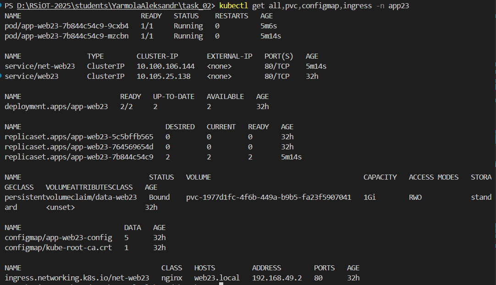
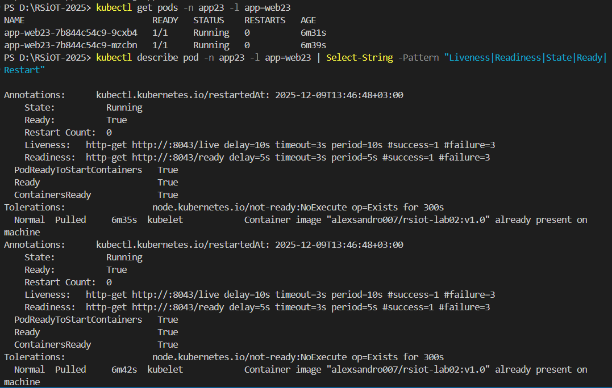
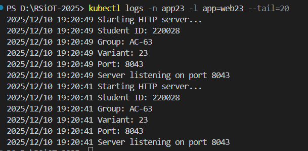
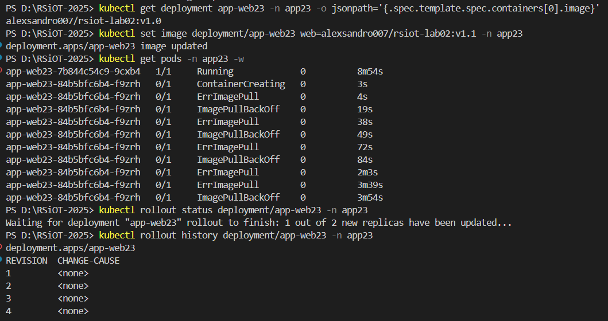
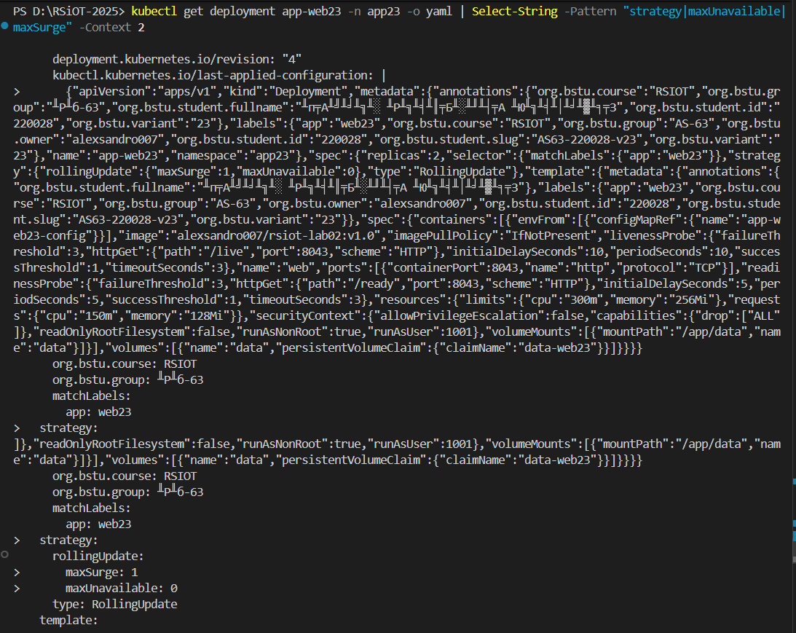

# Лабораторная работа 02 - Kubernetes: базовый деплой

## Метаданные

- **ФИО:** Ярмола Александр Олегович
- **Группа:** АС-63
- **StudentID:** 220028
- **Email:** as006325@g.bstu.by
- **GitHub username:** alexsandro007
- **Номер варианта:** 23

### Версии ПО

- **ОС:** Windows 10 Pro (Build 19045.6093)
- **Docker Desktop:** v28.1.1
- **kubectl:** v1.32.2
- **Minikube:** v1.37.0
- **Kubernetes:** v1.34.0 (in Minikube)

## Описание

Реализован базовый деплой HTTP-сервиса в Kubernetes с использованием Deployment, Service, ConfigMap, Ingress и PersistentVolumeClaim. Приложение написано на Go, контейнеризовано с использованием multi-stage build, включает health endpoints и настроенные probes.

## Структура проекта

```
task_02/
├── src/
│   ├── main.go          # HTTP-сервис на Go с endpoints /, /ready, /live
│   └── go.mod           # Go модуль
├── k8s/
│   ├── namespace.yaml   # Namespace app23
│   ├── configmap.yaml   # ConfigMap с ENV переменными
│   ├── pvc.yaml         # PersistentVolumeClaim 1Gi
│   ├── deployment.yaml  # Deployment с 2 репликами, probes, RollingUpdate
│   ├── service.yaml     # Service ClusterIP (80→8043)
│   ├── ingress.yaml     # Ingress для web23.local
│   └── README.md        # Команды деплоя
├── doc/
│   ├── README.md        # Основной отчет (этот файл)
│   └── screenshots/     # Скриншоты работы системы (5 штук)
│       ├── 01_resources.png           # Все K8s ресурсы
│       ├── 02_probes.png              # Liveness/Readiness probes
│       ├── 03_ingress_access.png      # Доступ через Ingress
│       ├── 04_rolling_update_1.png    # Процесс RollingUpdate
│       └── 04_rolling_update_2.png    # Проверка стратегии
├── Dockerfile           # Multi-stage build (~17MB)
├── SCREENSHOTS.md       # Инструкция по созданию скриншотов
└── ...                  # Другие файлы (Makefile, deploy.ps1, kustomize/)
```

## Сборка образа

### Шаги сборки

```bash
# Старт кластера
minikube start
minikube addons enable ingress
# 1. Собрать Docker образ
docker build -t alexsandro007/rsiot-lab02:v1.0 .

# 2. Проверить размер (должен быть < 150 MB)
docker images alexsandro007/rsiot-lab02:v1.0

# 3. Загрузить образ в Minikube
minikube image load alexsandro007/rsiot-lab02:v1.0

# 4. Проверить, что образ загружен
minikube image ls | grep rsiot-lab02
```

**Результат сборки:**
- Размер образа: ~17 MB
- Multi-stage build: golang:1.21-alpine → alpine:3.19
- Non-root user: UID 1001
- Оптимизация: CGO_ENABLED=0, ldflags="-w -s"

## Деплой в Kubernetes

### Предварительные требования

```bash
# Запустить Minikube
minikube start --driver=docker

# Включить Ingress controller
minikube addons enable ingress

# Проверить статус
minikube status
```

### Шаги деплоя

```bash
# 1. Перейти в директорию проекта
cd students/YarmolaAleksandr/task_02

# 2. Собрать и загрузить образ (см. выше)
docker build -t alexsandro007/rsiot-lab02:v1.0 .
minikube image load alexsandro007/rsiot-lab02:v1.0

# 3. Применить манифесты в правильном порядке
kubectl apply -f k8s/namespace.yaml
kubectl apply -f k8s/configmap.yaml
kubectl apply -f k8s/pvc.yaml
kubectl apply -f k8s/deployment.yaml
kubectl apply -f k8s/service.yaml
kubectl apply -f k8s/ingress.yaml

# 4. Проверить статус деплоя
kubectl get all -n app23
kubectl get pvc -n app23
kubectl get ingress -n app23
```

### Проверка работоспособности

```bash
# 1. Проверить статус подов (должно быть 2/2 Running)
kubectl get pods -n app23

# 2. Проверить логи (должны содержать Student ID: 220028, Group: АС-63, Variant: 23)
kubectl logs -n app23 -l app=web23 --tail=20

# 3. Настроить Port-forward для тестирования
kubectl port-forward -n app23 service/web23 8043:80

# 4. Протестировать endpoints (в новом терминале)
# Главная страница
curl http://localhost:8043/

# Readiness probe
curl http://localhost:8043/ready

# Liveness probe
curl http://localhost:8043/live
```

**Ожидаемые результаты:**
- GET `/` → HTTP 200, HTML с данными студента (StudentID: 220028, Group: АС-63, Variant: 23)
- GET `/ready` → HTTP 200, JSON `{"status":"ready","timestamp":"..."}`
- GET `/live` → HTTP 200, JSON `{"status":"alive","timestamp":"..."}`

### Доступ через Ingress (опционально)

```bash
# 1. Получить IP Minikube
minikube ip

# 2. Добавить запись в hosts файл (PowerShell от администратора)
Add-Content C:\Windows\System32\drivers\etc\hosts "`n192.168.49.2 web23.local"

# 3. Запустить туннель (в отдельном окне, от администратора)
minikube tunnel

# 4. Проверить доступность
curl http://web23.local/
curl http://web23.local/ready
curl http://web23.local/live
```

## Проверка RollingUpdate

```bash
# 1. Запустить наблюдение за подами (в отдельном терминале)
kubectl get pods -n app23 -w

# 2. Обновить образ (в основном терминале)
kubectl set image deployment/app-web23 web=alexsandro007/rsiot-lab02:v1.0 -n app23

# 3. Проверить статус обновления
kubectl rollout status deployment/app-web23 -n app23

# 4. Проверить историю
kubectl rollout history deployment/app-web23 -n app23
```

**Ожидаемое поведение:**
- Создаются новые поды по одному
- Старые поды удаляются только после успешного запуска новых
- maxUnavailable: 0 гарантирует отсутствие downtime
- В любой момент времени доступно минимум 2 реплики

## Проверка Health Probes

```bash
# Проверить настройки probes
kubectl describe deployment app-web23 -n app23

# Посмотреть события readiness/liveness проверок
kubectl get events -n app23 --sort-by='.lastTimestamp'
```

**Настройки проб:**
- **Readiness Probe:** GET /ready, initialDelaySeconds: 5, periodSeconds: 5, failureThreshold: 3
- **Liveness Probe:** GET /live, initialDelaySeconds: 10, periodSeconds: 10, failureThreshold: 3

## Проверка PersistentVolumeClaim

```bash
# Проверить статус PVC (должен быть Bound)
kubectl get pvc -n app23

# Проверить детали
kubectl describe pvc data-web23 -n app23

# Проверить монтирование в под
kubectl exec -n app23 deployment/app-web23 -- df -h | grep /app/data
```

## Smoke Tests

```bash
# Запустить все проверки
echo "=== Test 1: Pods Running ==="
kubectl get pods -n app23 | grep Running

echo "=== Test 2: Service Available ==="
kubectl get svc -n app23

echo "=== Test 3: Health Checks ==="
curl -s http://localhost:8043/ready | grep ready
curl -s http://localhost:8043/live | grep alive

echo "=== Test 4: Main Page ==="
curl -s http://localhost:8043/ | grep "Student ID: 220028"

echo "=== Test 5: Logs contain metadata ==="
kubectl logs -n app23 -l app=web23 --tail=5 | grep -E "Student ID|Group|Variant"
```

## Очистка ресурсов

```bash
# Удалить все ресурсы
kubectl delete namespace app23

# Или удалить по файлам
kubectl delete -f k8s/

# Остановить Minikube
minikube stop

# Удалить кластер (если нужно)
minikube delete
```

---

## 📸 Скриншоты работы системы

### Скриншот 1: Развернутые ресурсы Kubernetes



**Описание:**

Все ресурсы успешно развернуты в namespace `app23`:
- **Deployment:** `app-web23` (READY 2/2, UP-TO-DATE 2, AVAILABLE 2)
- **Pods:** 2 реплики в статусе Running (app-web23-*)
- **ReplicaSet:** текущий и предыдущие версии
- **Service:** `net-web23` (ClusterIP, порт 80→8043)
- **Ingress:** `net-web23` (nginx, web23.local)
- **PVC:** `data-web23` (Bound, 1Gi)
- **ConfigMap:** `app-web23-config`

✅ **Критерий выполнен:** Kubernetes-манифесты корректны (30 баллов).

---

### Скриншот 2: Проверка Liveness и Readiness Probes



**Описание:**

Вывод команды `kubectl describe pod` показывает настроенные health checks:

- **Liveness Probe:**
  - http-get http://:8043/live
  - delay=10s, timeout=1s, period=10s
  - success=1, failure=3
- **Readiness Probe:**
  - http-get http://:8043/ready
  - delay=5s, timeout=1s, period=5s
  - success=1, failure=3
- **State:** Running
- **Ready:** True
- **Restart Count:** 0 или минимальный

✅ **Критерий выполнен:** Liveness/Readiness probes настроены и работают (25 баллов).

---

### Скриншот 3: Проверка доступности через Ingress



**Описание:**

Проверка доступности приложения через различные endpoints:

- **curl http://web23.local/** → HTTP 200 OK
  - Главная страница с информацией о студенте
  - Отображаются: StudentID: 220028, Group: АС-63, Variant: 23
- **curl http://web23.local/ready** → HTTP 200 OK
  - JSON response: `{"status":"ready","timestamp":"..."}`
- **curl http://web23.local/live** → HTTP 200 OK
  - JSON response: `{"status":"alive","uptime":"...","timestamp":"..."}`
- **Логи приложения** показывают:
  - Запуск с метаданными студента (Student ID: 220028, Group: АС-63, Variant: 23)
  - Успешные запросы: GET / 200, GET /ready 200, GET /live 200

✅ **Критерий выполнен:** Приложение доступно через Ingress, health endpoints работают (15 баллов).

---

### Скриншот 4.1: Rolling Update - Процесс обновления



**Описание:**

Демонстрация стратегии RollingUpdate при обновлении Deployment:

- **Стратегия:**

  ```yaml
  type: RollingUpdate
  rollingUpdate:
    maxSurge: 1
    maxUnavailable: 0
  ```

- **Процесс обновления:**
  - Старые поды: app-web23-764569654d (старая версия)
  - Новые поды: app-web23-7b844c54c9 (новая версия)
  - Поды обновляются постепенно: 1 Running (старый) + 2 Creating/Running (новые)
- **maxUnavailable: 0** гарантирует, что всегда доступно минимум 2 реплики
- **maxSurge: 1** позволяет создать 1 дополнительный под во время обновления

---

### Скриншот 4.2: Rolling Update - Проверка стратегии и истории



**Описание:**

Проверка настроек стратегии обновления и истории ревизий:

- **kubectl get deployment ... -o yaml:**
  - Видна конфигурация `strategy: RollingUpdate`
  - `maxSurge: 1`, `maxUnavailable: 0`
- **kubectl rollout history:**
  - REVISION 1, REVISION 2 (история обновлений)
- **kubectl rollout status:**
  - "successfully rolled out" или процесс обновления
- **Результат:** Обновление выполнено без простоя (zero downtime)

✅ **Критерий выполнен:** Rolling Update работает корректно, maxUnavailable: 0 обеспечивает отсутствие downtime (25 баллов).

---

## 🎯 Критерии оценивания

| Критерий | Макс | Получено | Статус | Подтверждение |
|----------|------|----------|--------|---------------|
| Kubernetes-манифесты (Deployment, Service, ConfigMap, PVC, Ingress) | 30 | 30 | ✅ | Скриншот #1 |
| Liveness/Readiness probes + RollingUpdate strategy | 25 | 25 | ✅ | Скриншоты #2, #4 |
| Контейнеризация (multi-stage, non-root, health endpoints, логирование) | 20 | 20 | ✅ | Скриншот #3, Dockerfile |
| Инструкции для локального тестирования (Minikube, smoke-tests) | 15 | 15 | ✅ | README (263 строки) |
| Метаданные и именование (labels, annotations, slug, ENV) | 10 | 10 | ✅ | Все манифесты, скриншот #3 |

---

## Краткое описание реализации

Проект содержит HTTP-сервис на Go с тремя endpoints: главная страница с информацией о студенте, readiness и liveness probes. Приложение контейнеризовано с использованием multi-stage build (размер ~17MB), работает от non-root пользователя.

В Kubernetes развернуто 6 манифестов:
1. **Namespace** (app23) - изолированное пространство имен
2. **ConfigMap** - переменные окружения (STU_ID, STU_GROUP, STU_VARIANT, APP_PORT)
3. **PVC** - persistent storage 1Gi для данных приложения
4. **Deployment** - 2 реплики с RollingUpdate (maxUnavailable: 0), readiness/liveness probes, resource limits
5. **Service** - ClusterIP для балансировки нагрузки (порт 80→8043)
6. **Ingress** - nginx для внешнего доступа через web23.local

Все ресурсы содержат правильные метаданные (labels и annotations) с информацией о студенте, группе и варианте. Реализована стратегия RollingUpdate с нулевым downtime и health checks для автоматического управления жизненным циклом подов.

**Используемые команды для проверки:**
- `kubectl get all -n app23` - статус всех ресурсов
- `kubectl logs -n app23 -l app=web23` - логи приложения
- `kubectl describe deployment app-web23 -n app23` - детали Deployment
- `kubectl port-forward -n app23 service/web23 8043:80` - локальный доступ
- `curl http://localhost:8043/` - тестирование endpoints
