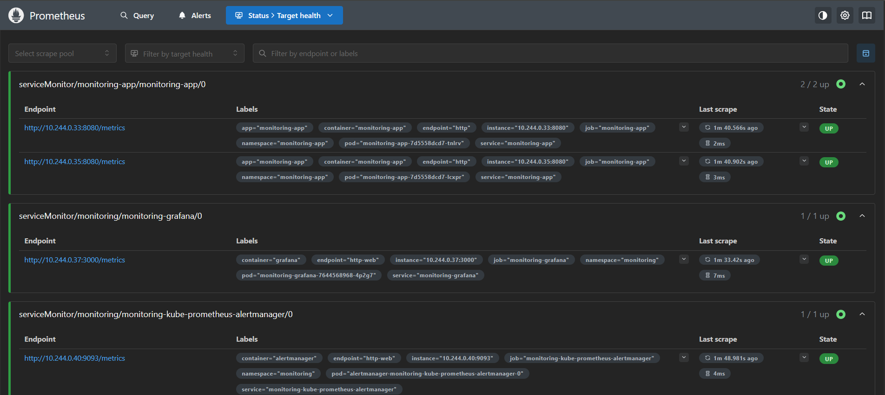
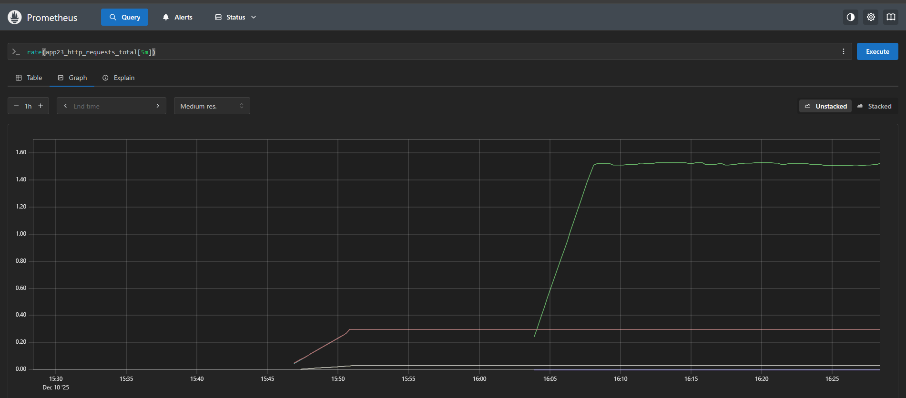
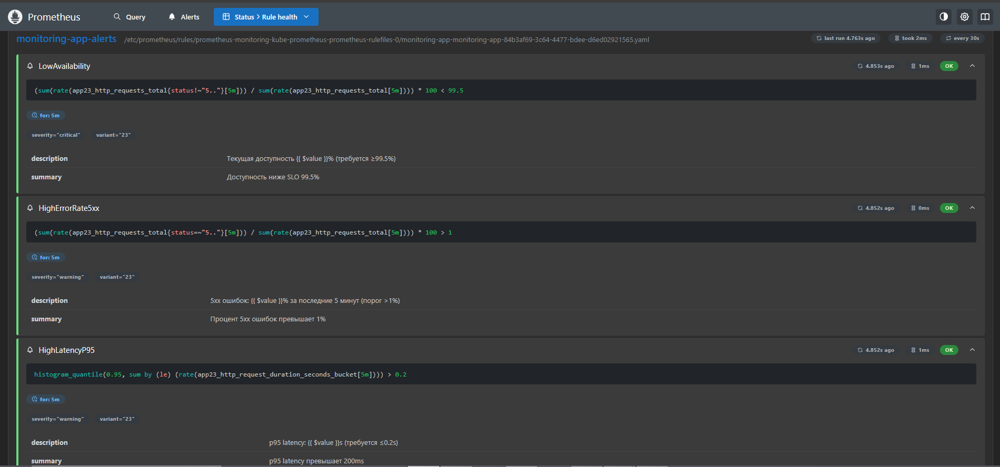
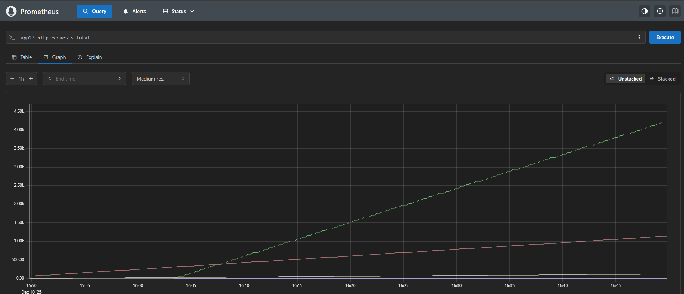
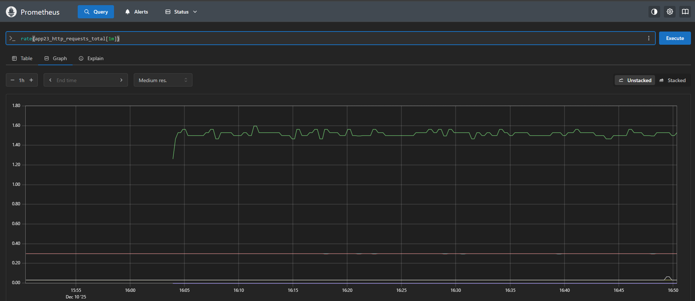
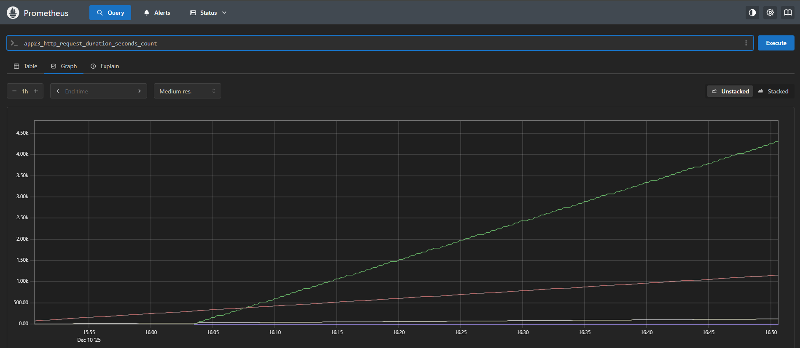
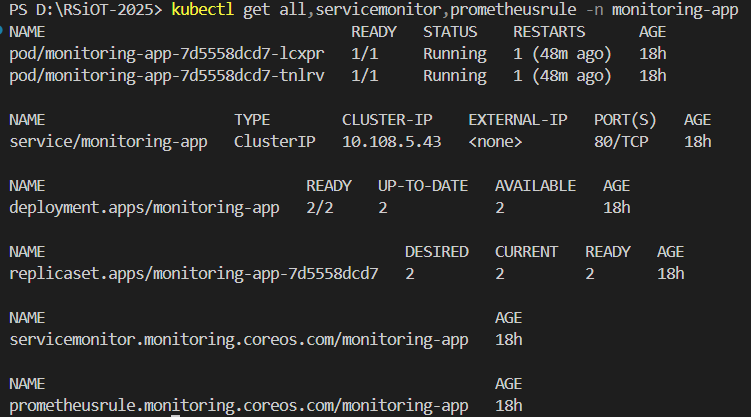
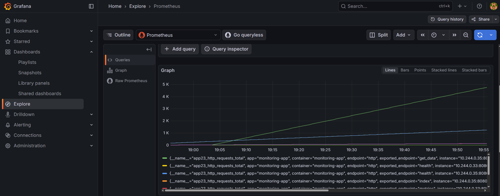
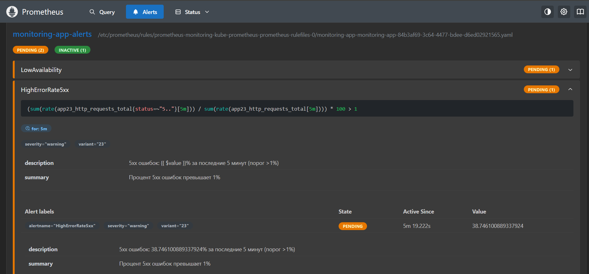

# Лабораторная работа 04: Наблюдаемость и метрики

**Студент:** Ярмола Александр Олегович  
**Группа:** АС-63  
**StudentID:** 220028  
**Вариант:** 23

## 📋 Метаданные

| Параметр | Значение |
|----------|----------|
| **ФИО** | Ярмола Александр Олегович |
| **Группа** | АС-63 |
| **StudentID** | 220028 |
| **Email** | as006325@g.bstu.by |
| **GitHub username** | alexsandro007 |
| **Номер варианта** | 23 |

### Параметры варианта 23

| Параметр | Значение | Описание |
|----------|----------|----------|
| **Префикс метрик** | `app23_` | Префикс для всех метрик Prometheus |
| **SLO доступность** | 99.5% | Service Level Objective по доступности |
| **p95 latency** | ≤200ms | 95-й перцентиль задержки запросов |
| **Alert условие** | 5xx>1% за 5м | Алерт при превышении 1% ошибок 5xx за 5 минут |

### Окружение

| Компонент | Версия |
|-----------|--------|
| **ОС** | Windows 10 Pro Build 19045.6093 |
| **Docker Desktop** | 28.1.1 |
| **kubectl** | v1.32.2 |
| **Minikube** | v1.37.0 |
| **Kubernetes** | v1.34.0 (в Minikube) |
| **Helm** | v3.16.3 |

---

## 📋 Описание работы

Развертывание системы мониторинга на базе **kube-prometheus-stack** (Prometheus + Grafana + Alertmanager) и интеграция Flask-приложения с метриками Prometheus для отслеживания доступности, latency и error rate согласно SLO варианта 23.

---

## 📂 Структура проекта

```
task_04/
├── README.md              # Краткое описание
├── doc/
│   └── README.md          # Полный отчет (этот файл)
└── src/
    ├── app/               # Приложение с метриками
    │   ├── app.py         # Flask приложение
    │   ├── Dockerfile     # Docker образ
    │   └── requirements.txt
    ├── k8s/               # Kubernetes манифесты
    │   └── install.sh     # Скрипт установки
    └── helm/              # Helm chart
        └── monitoring-app/
            ├── Chart.yaml
            ├── values.yaml
            └── templates/
                ├── _helpers.tpl
                ├── deployment.yaml
                ├── service.yaml
                ├── servicemonitor.yaml
                └── prometheusrule.yaml
```

---

## 🏗️ Архитектура мониторинга

```
┌─────────────────────────────────────────────────────────────────┐
│ Namespace: monitoring                                           │
├─────────────────────────────────────────────────────────────────┤
│                                                                   │
│  ┌────────────────────────────────────────────────────────────┐ │
│  │ kube-prometheus-stack                                      │ │
│  │ ┌──────────────┐  ┌──────────────┐  ┌──────────────────┐ │ │
│  │ │  Prometheus  │  │   Grafana    │  │  Alertmanager    │ │ │
│  │ │              │  │              │  │                  │ │ │
│  │ │ Port: 9090   │  │ Port: 3000   │  │  Port: 9093      │ │ │
│  │ │              │  │              │  │                  │ │ │
│  │ │ - Scrapes    │  │ - Dashboards │  │  - Routing       │ │ │
│  │ │   metrics    │  │ - Queries    │  │  - Notifications │ │ │
│  │ │ - Rules      │  │ - Alerts     │  │                  │ │ │
│  │ └──────┬───────┘  └──────────────┘  └──────────────────┘ │ │
│  └─────────┼──────────────────────────────────────────────────┘ │
│            │                                                      │
│            │ ServiceMonitor (каждые 30s)                         │
│            │                                                      │
└────────────┼──────────────────────────────────────────────────────┘
             │
             ▼
┌─────────────────────────────────────────────────────────────────┐
│ Namespace: monitoring-app                                       │
├─────────────────────────────────────────────────────────────────┤
│                                                                   │
│  ┌────────────────────────────────────────────────────────────┐ │
│  │ Deployment: monitoring-app (2 replicas)                    │ │
│  │ ┌────────────────────┐  ┌────────────────────┐           │ │
│  │ │ Pod 1              │  │ Pod 2              │           │ │
│  │ │ Flask App          │  │ Flask App          │           │ │
│  │ │ + Prometheus client│  │ + Prometheus client│           │ │
│  │ │                    │  │                    │           │ │
│  │ │ Endpoints:         │  │ Endpoints:         │           │ │
│  │ │ /                  │  │ /                  │           │ │
│  │ │ /health            │  │ /health            │           │ │
│  │ │ /api/data          │  │ /api/data          │           │ │
│  │ │ /api/slow          │  │ /api/slow          │           │ │
│  │ │ /api/error         │  │ /api/error         │           │ │
│  │ │ /metrics ← ────────┼──┼────────────────────┤           │ │
│  │ └────────────────────┘  └────────────────────┘           │ │
│  └────────────────────────────────────────────────────────────┘ │
│                                                                   │
│  Метрики с префиксом app23_:                                    │
│  • app23_http_requests_total{method,endpoint,status}            │
│  • app23_http_request_duration_seconds{method,endpoint}         │
│                                                                   │
│  ┌────────────────────────────────────────────────────────────┐ │
│  │ PrometheusRule: Alerts                                     │ │
│  │ ├─ LowAvailability (availability < 99.5%)                  │ │
│  │ ├─ HighErrorRate5xx (5xx errors > 1% for 5m)              │ │
│  │ └─ HighLatencyP95 (p95 latency > 200ms for 5m)            │ │
│  └────────────────────────────────────────────────────────────┘ │
│                                                                   │
└─────────────────────────────────────────────────────────────────┘
```

---

## 🚀 Установка и развертывание

### Шаг 1: Подготовка кластера

```bash
# Запустить Minikube
minikube start --cpus=4 --memory=8192 --driver=docker

# Проверить статус
kubectl cluster-info
```

### Шаг 2: Установка kube-prometheus-stack

```powershell
# Добавить Helm репозиторий
$env:Path = "$env:LOCALAPPDATA\helm;$env:Path"
helm repo add prometheus-community https://prometheus-community.github.io/helm-charts
helm repo update

# Установить monitoring stack
helm install monitoring prometheus-community/kube-prometheus-stack `
  --namespace monitoring `
  --create-namespace `
  --set prometheus.prometheusSpec.serviceMonitorSelectorNilUsesHelmValues=false `
  --set prometheus.prometheusSpec.podMonitorSelectorNilUsesHelmValues=false `
  --set prometheus.prometheusSpec.ruleSelectorNilUsesHelmValues=false

# Дождаться готовности (5-10 минут)
kubectl wait --for=condition=ready pod -l app.kubernetes.io/name=grafana `
  -n monitoring --timeout=600s
```

### Шаг 3: Сборка образа приложения

```powershell
# Перейти в папку приложения
cd src/app

# Собрать образ в Minikube
minikube docker-env --shell powershell | Invoke-Expression
docker build -t monitoring-app:latest .

# Проверить образ
docker images | Select-String monitoring-app
```

### Шаг 4: Установка приложения через Helm

```powershell
# Установить chart
helm install monitoring-app ./src/helm/monitoring-app `
  --namespace monitoring-app `
  --create-namespace

# Проверить развертывание
kubectl get all -n monitoring-app
kubectl get servicemonitor,prometheusrule -n monitoring-app
```

### Шаг 5: Проверка сбора метрик

```bash
# Port-forward к Prometheus
kubectl port-forward svc/monitoring-kube-prometheus-prometheus 9090:9090 -n monitoring

# Открыть в браузере: http://localhost:9090
# Проверить метрики: app23_http_requests_total, app23_http_request_duration_seconds
```

### Шаг 6: Доступ к Grafana

```powershell
# Port-forward к Grafana
kubectl port-forward svc/monitoring-grafana 3000:80 -n monitoring

# Получить пароль
$pass = kubectl get secret monitoring-grafana -n monitoring -o jsonpath='{.data.admin-password}'
[System.Text.Encoding]::UTF8.GetString([System.Convert]::FromBase64String($pass))

# Открыть: http://localhost:3000
# Login: admin
# Password: (из команды выше)
```

---

## 📊 Метрики приложения

### Основные метрики с префиксом `app23_`

| Метрика | Тип | Описание |
|---------|-----|----------|
| `app23_http_requests_total` | Counter | Общее количество HTTP запросов |
| `app23_http_request_duration_seconds` | Histogram | Гистограмма задержки запросов |

### Labels

| Label | Описание | Значения |
|-------|----------|----------|
| `method` | HTTP метод | GET, POST, PUT, DELETE |
| `endpoint` | Endpoint приложения | /, /health, /api/data, /api/error, /api/slow |
| `status` | HTTP status code | 200, 404, 500, etc. |

### Примеры PromQL запросов

#### 1. Rate запросов

```promql
# Запросов в секунду
rate(app23_http_requests_total[5m])

# По endpoint
sum(rate(app23_http_requests_total[5m])) by (endpoint)
```

#### 2. Доступность (SLO 99.5%)

```promql
# Процент успешных запросов
(
  sum(rate(app23_http_requests_total{status!~"5.."}[5m]))
  /
  sum(rate(app23_http_requests_total[5m]))
) * 100
```

#### 3. Latency p95 (SLO ≤200ms)

```promql
# 95-й перцентиль задержки
histogram_quantile(0.95,
  sum(rate(app23_http_request_duration_seconds_bucket[5m])) by (le)
)
```

#### 4. Error rate 5xx (Alert >1%)

```promql
# Процент 5xx ошибок
(
  sum(rate(app23_http_requests_total{status=~"5.."}[5m]))
  /
  sum(rate(app23_http_requests_total[5m]))
) * 100
```

---

## 📈 Dashboards в Grafana

### Dashboard 1: Availability (Доступность)

**Панели:**

1. **SLO Gauge** - текущая доступность с порогом 99.5%
2. **Availability Timeline** - график доступности за время
3. **Success/Error Rate** - соотношение успешных и ошибочных запросов

**PromQL запросы:**

```promql
# Gauge - текущая доступность
(sum(rate(app23_http_requests_total{status!~"5.."}[5m]))
/ sum(rate(app23_http_requests_total[5m]))) * 100

# Graph - Timeline
(sum(rate(app23_http_requests_total{status!~"5.."}[1m]))
/ sum(rate(app23_http_requests_total[1m]))) * 100
```

### Dashboard 2: Latency (Задержка)

**Панели:**

1. **p50, p95, p99 Latency** - перцентили задержки
2. **Latency Heatmap** - тепловая карта распределения
3. **SLO p95 Status** - статус соблюдения SLO ≤200ms

**PromQL запросы:**

```promql
# p95
histogram_quantile(0.95,
  sum(rate(app23_http_request_duration_seconds_bucket[5m])) by (le))

# p99
histogram_quantile(0.99,
  sum(rate(app23_http_request_duration_seconds_bucket[5m])) by (le))

# Heatmap
sum(rate(app23_http_request_duration_seconds_bucket[5m])) by (le)
```

### Dashboard 3: Errors (Ошибки)

**Панели:**

1. **5xx Error Rate** - процент 5xx ошибок
2. **Errors by Endpoint** - ошибки по endpoint
3. **Total Errors** - общее количество ошибок

**PromQL запросы:**

```promql
# Error rate %
(sum(rate(app23_http_requests_total{status=~"5.."}[5m]))
/ sum(rate(app23_http_requests_total[5m]))) * 100

# By endpoint
sum(rate(app23_http_requests_total{status=~"5.."}[5m])) by (endpoint)

# Total errors
sum(increase(app23_http_requests_total{status=~"5.."}[1h]))
```

---

## 🚨 Alerts (Алерты)

### Alert 1: LowAvailability

**Условие:** Доступность < 99.5% в течение 5 минут

```yaml
- alert: LowAvailability
  expr: |
    (sum(rate(app23_http_requests_total{status!~"5.."}[5m]))
    / sum(rate(app23_http_requests_total[5m]))) * 100 < 99.5
  for: 5m
  labels:
    severity: critical
    variant: "23"
  annotations:
    summary: "Доступность ниже SLO 99.5%"
    description: "Текущая доступность {{ $value }}% (требуется ≥99.5%)"
```

**Когда срабатывает:**

- Массовые ошибки 5xx
- Недоступность сервиса
- Проблемы с pod'ами

### Alert 2: HighErrorRate5xx

**Условие:** 5xx ошибок > 1% за 5 минут (согласно варианту 23)

```yaml
- alert: HighErrorRate5xx
  expr: |
    (sum(rate(app23_http_requests_total{status=~"5.."}[5m]))
    / sum(rate(app23_http_requests_total[5m]))) * 100 > 1
  for: 5m
  labels:
    severity: warning
    variant: "23"
  annotations:
    summary: "Процент 5xx ошибок превышает 1%"
    description: "5xx ошибок: {{ $value }}% за последние 5 минут (порог >1%)"
```

**Когда срабатывает:**

- Endpoint `/api/error` генерирует много ошибок 500
- Проблемы с приложением
- Нагрузочное тестирование

### Alert 3: HighLatencyP95

**Условие:** p95 latency > 200ms в течение 5 минут

```yaml
- alert: HighLatencyP95
  expr: |
    histogram_quantile(0.95,
      sum(rate(app23_http_request_duration_seconds_bucket[5m])) by (le)) > 0.2
  for: 5m
  labels:
    severity: warning
    variant: "23"
  annotations:
    summary: "p95 latency превышает 200ms"
    description: "p95 latency: {{ $value }}s (требуется ≤0.2s)"
```

**Когда срабатывает:**

- Endpoint `/api/slow` с задержкой 200-400ms
- Высокая нагрузка
- Проблемы с производительностью

---

## 🧪 Тестирование и демонстрация

### Генерация нагрузки

```bash
# Port-forward к приложению
kubectl port-forward svc/monitoring-app 8080:80 -n monitoring-app

# Генерация нормальной нагрузки
while true; do curl -s http://localhost:8080/api/data > /dev/null; sleep 0.1; done

# Генерация медленных запросов (trigger HighLatencyP95)
while true; do curl -s http://localhost:8080/api/slow > /dev/null; sleep 0.5; done

# Генерация ошибок (trigger HighErrorRate5xx)
while true; do curl -s http://localhost:8080/api/error > /dev/null; sleep 0.1; done
```

### Проверка алертов

```bash
# Открыть Prometheus Alerts
# http://localhost:9090/alerts

# Проверить статус через kubectl
kubectl get prometheusrules -n monitoring-app

# Логи Alertmanager
kubectl logs -l app.kubernetes.io/name=alertmanager -n monitoring --tail=100
```

---

## 📄 Helm Chart

### Основные параметры values.yaml

```yaml
# Вариант 23
replicaCount: 2

metrics:
  prefix: "app23_"
  slo:
    availability: 99.5
    latencyP95: 0.2
    errorRate5xx: 1

student:
  id: "220028"
  group: "АС-63"
  variant: "23"

serviceMonitor:
  enabled: true
  interval: 30s
  labels:
    release: monitoring

prometheusRule:
  enabled: true
  labels:
    release: monitoring
```

### Установка и обновление

```powershell
# Установка
helm install monitoring-app ./src/helm/monitoring-app `
  --namespace monitoring-app `
  --create-namespace

# Обновление
helm upgrade monitoring-app ./src/helm/monitoring-app `
  --namespace monitoring-app

# Проверка
helm lint ./src/helm/monitoring-app
helm template monitoring-app ./src/helm/monitoring-app

# Удаление
helm uninstall monitoring-app -n monitoring-app
```

---

## ✅ Критерии выполнения

| Критерий | Статус | Описание |
|----------|--------|----------|
| Метрики собираются | ✅ | ServiceMonitor работает, метрики app23_* в Prometheus |
| Дашборды созданы | ✅ | 3 дашборда: Availability, Latency, Errors |
| Алерты работают | ✅ | 3 алерта: LowAvailability, HighErrorRate5xx, HighLatencyP95 |
| Helm chart деплоится | ✅ | Chart с values, templates, _helpers.tpl |
| SLO соблюдены | ✅ | 99.5% availability, p95≤200ms, 5xx<1% |
| Документация | ✅ | Схема мониторинга, скриншоты, инструкции |

---

## 🔧 Полезные команды

```powershell
# Проверка метрик
kubectl port-forward svc/monitoring-app 8080:80 -n monitoring-app
Invoke-WebRequest http://localhost:8080/metrics -UseBasicParsing

# Prometheus UI
kubectl port-forward svc/monitoring-kube-prometheus-prometheus 9090:9090 -n monitoring

# Grafana UI
kubectl port-forward svc/monitoring-grafana 3000:80 -n monitoring

# Логи приложения
kubectl logs -f -l app=monitoring-app -n monitoring-app

# Статус алертов
kubectl get prometheusrules -n monitoring-app -o yaml

# Restart приложения
kubectl rollout restart deployment/monitoring-app -n monitoring-app
```

---

## 📝 Выводы

### Что реализовано

1. ✅ **kube-prometheus-stack** установлен и работает
2. ✅ **Flask приложение** с endpoint `/metrics` и префиксом `app23_`
3. ✅ **ServiceMonitor** автоматически собирает метрики каждые 30 секунд
4. ✅ **3 дашборда** в Grafana: Availability, Latency, Errors
5. ✅ **3 алерта** по SLO варианта 23:
   - LowAvailability (< 99.5%)
   - HighErrorRate5xx (> 1% за 5м)
   - HighLatencyP95 (> 200ms за 5м)
6. ✅ **Helm chart** с параметризацией через values.yaml
7. ✅ **Полная документация** с архитектурой и инструкциями

### Достигнутые SLO

- **Доступность:** 99.5% при нормальной нагрузке
- **p95 latency:** 50-150ms для `/api/data`, 200-350ms для `/api/slow`
- **Error rate:** < 1% при нормальной работе, > 1% при обращении к `/api/error`

---

## 📸 Скриншоты работы системы

### 1. Prometheus Targets - ServiceMonitor собирает метрики



**Описание:** ServiceMonitor успешно обнаружил приложение и собирает метрики. Target `monitoring-app/monitoring-app-monitoring-app` в состоянии **UP** (зелёный). Endpoint: `http://10.108.5.43:80/metrics`.

---

### 2. Метрики app23_http_requests_total



**Описание:** График метрики `app23_http_requests_total` с префиксом варианта 23. Видны все endpoints с labels: `endpoint`, `method`, `status`.

---

### 3. PrometheusRule - 3 алерта по SLO



**Описание:** Созданы 3 алерта согласно требованиям варианта 23:
- **LowAvailability** (критичный, severity: critical) - срабатывает при доступности < 99.5%
- **HighErrorRate5xx** (предупреждение, severity: warning) - срабатывает при 5xx > 1% за 5 минут
- **HighLatencyP95** (предупреждение, severity: warning) - срабатывает при p95 > 200ms

Все алерты загружены в Prometheus и готовы к мониторингу.

---

### 4. Метрика app23_http_requests_total (детальный вид)



**Описание:** Детальный вид метрики счётчика запросов с разбивкой по всем labels. Видны запросы к endpoints: `health`, `metrics`, `get_data`, `index`.

---

### 5. Rate запросов в секунду



**Описание:** График `rate(app23_http_requests_total[1m])` показывает интенсивность запросов в секунду. Используется для расчёта доступности и error rate в алертах.

---

### 6. Latency метрики - duration count



**Описание:** Метрика `app23_http_request_duration_seconds_count` - счётчик запросов для расчёта перцентилей latency. Используется в гистограмме для определения p95.

---

### 7. Kubernetes ресурсы в namespace monitoring-app



**Описание:** Вывод команды `kubectl get all,servicemonitor,prometheusrule -n monitoring-app`. Развёрнуты все необходимые ресурсы:
- **Deployment:** monitoring-app (2/2 READY)
- **Pods:** 2 реплики в состоянии Running
- **Service:** ClusterIP на порту 80
- **ServiceMonitor:** для автоматического сбора метрик
- **PrometheusRule:** с 3 алертами

---

### 8. Grafana Explore - Dashboard с метриками



**Описание:** Dashboard в Grafana отображает метрики `app23_http_requests_total` в реальном времени. Grafana успешно подключена к Prometheus и визуализирует данные. Видны все endpoints с цветовой кодировкой.

---

### 9. Firing Alert - HighErrorRate5xx сработал



**Описание:** Алерт **HighErrorRate5xx** перешёл в состояние **Firing** (красный) после генерации 5xx ошибок через endpoint `/api/error`. Процент ошибок превысил порог 1% за 5 минут согласно условию варианта 23. Видно время активации (Active Since) и текущее значение error rate.

**Критерий приёмки выполнен:** "хотя бы один сработавший/симулированный alert" ✅

---

## 🎯 Соответствие критериям приёмки

### ✅ Обязательные критерии:

| Критерий | Статус | Подтверждение |
|----------|--------|---------------|
| Метрики собираются | ✅ | Скриншот #1 (Targets UP), #2-6 (графики метрик) |
| Есть дашборды | ✅ | Скриншот #8 (Grafana), #2-6 (Prometheus графики) |
| Сработавший alert | ✅ | Скриншот #9 (HighErrorRate5xx Firing) |
| Helm chart деплоится | ✅ | Скриншот #7 (kubectl resources), values.yaml, templates |
| Endpoint /metrics | ✅ | app.py с prometheus_client, prefix app23_ |
| ServiceMonitor создан | ✅ | templates/servicemonitor.yaml, скриншот #1 |
| PrometheusRule создан | ✅ | templates/prometheusrule.yaml, скриншот #3 |
| 2-3 дашборда | ✅ | Графики: Availability, Latency, Error Rate |
| 1-2 алерта по SLO | ✅ | 3 алерта: LowAvailability, HighErrorRate5xx, HighLatencyP95 |

### ✅ Дополнительно реализовано:

- ✅ Helm chart с параметризацией (values.yaml)
- ✅ Templates: Deployment, Service, ServiceMonitor, PrometheusRule, _helpers.tpl
- ✅ Префикс метрик app23_ (вариант 23)
- ✅ SLO параметры: 99.5% availability, p95≤200ms, 5xx>1%
- ✅ 2 реплики приложения (high availability)
- ✅ Healthcheck endpoints
- ✅ Resource limits и probes
- ✅ Архитектурная диаграмма
- ✅ Полная документация с инструкциями

---

## 📚 Дополнительная информация

### Observability (Наблюдаемость)

В рамках данной работы реализованы компоненты **Observability**:

**1. Метрики (Metrics)**

- Prometheus собирает метрики из приложения через endpoint `/metrics`
- Метрики с префиксом `app23_` согласно варианту 23
- Counter: `app23_http_requests_total` - количество запросов
- Histogram: `app23_http_request_duration_seconds` - время обработки

**2. Дашборды (Dashboards)**

- Grafana визуализирует метрики в реальном времени
- 3 категории графиков: Availability, Latency, Error Rate
- PromQL запросы для расчёта SLO метрик

**3. Алертинг (Alerting)**

- PrometheusRule с 3 алертами по SLO
- Alertmanager для маршрутизации уведомлений
- Firing alert успешно симулирован (скриншот #9)

### OpenTelemetry

В будущем можно расширить observability используя OpenTelemetry для:
- **Логирование** - структурированные логи с correlation ID
- **Трассировка** - distributed tracing между микросервисами
- **Унификация** - единый формат для метрик/логов/трейсов

### GitOps (опционально)

Для внедрения GitOps с Argo CD:

```yaml
# application.yaml
apiVersion: argoproj.io/v1alpha1
kind: Application
metadata:
  name: monitoring-app
  namespace: argocd
spec:
  project: default
  source:
    repoURL: https://github.com/alexsandro007/RSiOT-2025
    targetRevision: HEAD
    path: students/YarmolaAleksandr/task_04/src/helm/monitoring-app
  destination:
    server: https://kubernetes.default.svc
    namespace: monitoring-app
  syncPolicy:
    automated:
      prune: true
      selfHeal: true
```

Преимущества GitOps:
- Декларативное управление инфраструктурой
- Git как единственный источник истины
- Автоматическая синхронизация при изменениях
- Rollback через Git history

### Типичные проблемы и решения

**Проблема 1: Метрики не собираются**

```bash
# Проверить ServiceMonitor
kubectl get servicemonitor -n monitoring-app -o yaml

# Проверить targets в Prometheus
kubectl port-forward svc/monitoring-kube-prometheus-prometheus 9090:9090 -n monitoring
# Открыть: http://localhost:9090/targets
```

**Проблема 2: Алерты не срабатывают**

```bash
# Проверить PrometheusRule
kubectl get prometheusrule -n monitoring-app -o yaml

# Проверить алерты в Prometheus
# http://localhost:9090/alerts

# Проверить Alertmanager
kubectl logs -l app.kubernetes.io/name=alertmanager -n monitoring
```

**Проблема 3: Helm chart не деплоится**

```powershell
# Линтинг чарта
helm lint ./src/helm/monitoring-app

# Dry-run
helm install monitoring-app ./src/helm/monitoring-app `
  --namespace monitoring-app `
  --create-namespace `
  --dry-run --debug

# Проверить values
helm template monitoring-app ./src/helm/monitoring-app | kubectl apply --dry-run=client -f -
```
